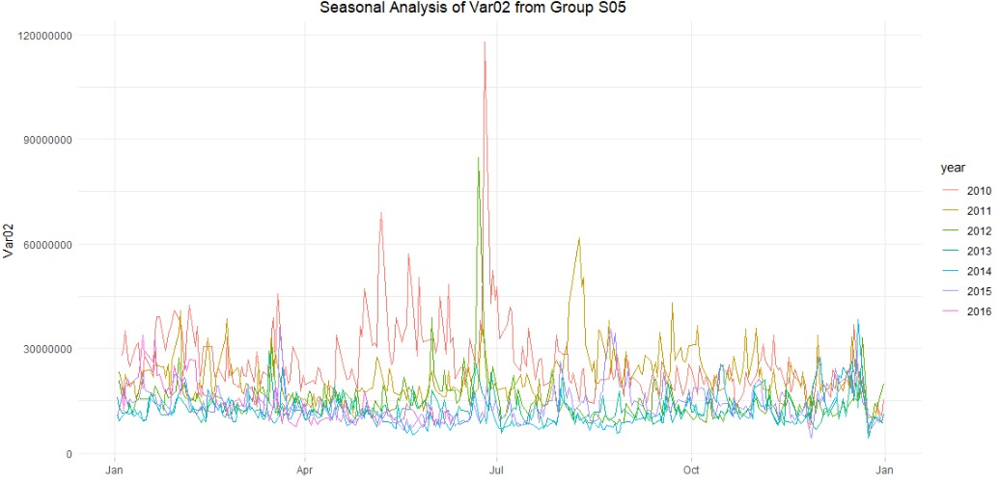

```{=html}
<style type="text/css">

code {
  font-family: "Consolas";
  font-size: 11px;
}

pre {
  font-family: "Consolas";
  font-size: 11px;
}

mark {
  background-color: whitesmoke;
  color: black;
}

</style>
```
```{r setup, include=FALSE}
knitr::opts_chunk$set(echo = TRUE, warning=F, message=F, include = T, echo = F, fig.height=3.5)

options(scipen = 9)
set.seed(101)

library(fpp2)
library(ggplot2)
library(tidyr)
library(dplyr)
library(seasonal)
library(imputeTS)
library(lubridate)
library(fpp3)
```

<font size="3">Group Members</font>

-   Subhalaxmi Rout
-   Kenan Sooklall
-   Devin Teran
-   Christian Thieme
-   Leo Yi

\pagebreak

## Introduction

```{r}
url <- 'https://raw.githubusercontent.com/christianthieme/Predictive-Analytics/main/Project1-TimeSeries/data624_project1_dataset.csv'

df <- read.csv(url)

# rename first column
names(df)[1] <- 'row_index'

# create copy of row index
df$date <- df$row_index

# convert first column copy to date
df$date <- as.Date(df$date, origin="1899-12-30") 

# convert column names to all lowercase
names(df) <- lapply(names(df), tolower)
```

The dataset for this project was provided as a de-identified excel spreadsheet that included six different *groups*. Each group had two variables to be forecasted 140 periods into the future using 1,622 historical periods. This data had been provided as time series data but the time period of the observations were not given. In place of a timestamp, we were given a column called `SeriesInd` which contains unique numerical values that represents an undisclosed time period.

Using `glimpse`, we can view the attributes of our dataset:

```{r}
glimpse(df)
```

In our initial exploration, we noticed that the index `SeriesInd` was in sequential order, however, after every 5 observations there would be two values missing before the series continued again. We used `count_gaps()` to analyze these implicit gaps within our data and came to the consensus that this was most likely daily data, showing data for Monday through Friday but excluding weekends and holidays. We move forward with this assumption.

\pagebreak

#### Initial Exploration of the Data

In order to forecast each variable within each group, we needed to break the larger dataset into its individual groups so we could perform our analysis and properly visualize our data.

```{r}
#### Separate Into Individual Sets

filter_group <- function(group_name) {
  temp_df <- df %>%
    filter(group == group_name) %>%
    dplyr::select(-group)
  return(temp_df[1:1622,])
}

S01 <- filter_group('S01') %>%
  select(row_index, date, var01, var02)

S02 <- filter_group('S02') %>%
  select(row_index, date, var02, var03)

S03 <- filter_group('S03') %>%
  select(row_index, date, var05, var07)

S04 <- filter_group('S04') %>%
  select(row_index, date, var01, var02)

S05 <- filter_group('S05') %>%
  select(row_index, date, var02, var03)

S06 <- filter_group('S06') %>%
  select(row_index, date, var05, var07)
```

We began by visualizing our data using a line-plot, this helped us to see initial trend, seasonality (or lack thereof), and cyclicity of our variables. In our analysis we identified two types of variables, one type seemed to have lower numerical values and moderate fluctuations from day to day. The other type of variable had very large numerical values and had extreme fluctuations from day to day. We'll visualize the two variables from group S05 below as an example:

```{r}
  ggplot(S05) +
  aes(x = row_index, y = var02) + 
  geom_line(color = 'steelblue') + 
  labs(title = 'Var02 Plot', x = 'time period') + 
  theme_minimal() + 
  theme(
    plot.title = element_text(hjust = 0.40),
          panel.grid.minor.x = element_blank(),
          axis.ticks.x = element_line(color = "grey")
  )
```

Looking at the plot above, you can see the values on the Y-axis are extremely large and the variation from day to day is fairly significant. Additionally, we can see several large spikes throughout in the series. In looking at this plot, because there is so much movement, it's hard to see if there is a trend or some type of seasonality. We determined additional visuals and tests would be needed to confirm.

\pagebreak

The other variables in our dataset looked very similar to Var03 from S05 shown below:

```{r}
  ggplot(S05) +
  aes(x = row_index, y = var03) + 
  geom_line(color = 'firebrick2') + 
  labs(title = 'Var03 Plot', x = 'time period') + 
  theme_minimal() + 
  theme(
    plot.title = element_text(hjust = 0.45),
          panel.grid.minor.x = element_blank(),
          axis.ticks.x = element_line(color = "grey")
  )
```

We can see variation within this type of variable is considerably less than in the the other type. Additionally, it looks like there is no apparent seasonality. In many of the variables of this type of data, we did see long trends (either upward or downward) and cyclicity. In looking at all the plots for every variable, we determined that further analysis was necessary to determine trend and seasonal components of the data.

\pagebreak

## Data Preparation

Many of the time series algorithms, both for forecasting and visualization, require that there be no missing values in the data. With this requirement, we deemed it necessary to fill nulls early in our data prep process.

#### Imputing Missing Values

In data preparation, imputation of missing values is a critical step. Each of the variables provided had missing values within the data and many approaches for filling them seemed appropriate. The approaches we took differed depending on if we were imputing for the first or second type of data. For the data that had large variations from day to day (that looked almost like white noise) we deemed taking an average appropriate. For the more stable datasets, we decided to use `tidyr::fill()` to fill the missing values with the previous value in the dataset. This seemed to make sense as each point in this datasets never seemed to be very far away from the previous one.

Below is a plot of Var05 and Var07 from S03. The vertical lines represent the points where there is missing data. In this case, we used `tidyr::fill()` to fill the missing value with the previous value in the dataset.You can see that by choosing this method, we haven't interfered with the natural trend of the data.

```{r}
# zoom in to data, 2017
S03 %>%
  select(-date) %>%
  gather(variable, value, -row_index) %>%
  ggplot(aes(x = row_index, y = value, color = variable)) +
  geom_line(alpha = 0.5) +
  geom_vline(xintercept = 42897, alpha = 0.3) +
  geom_vline(xintercept = 42898, alpha = 0.3) +
  geom_vline(xintercept = 42997, alpha = 0.3) +
  geom_vline(xintercept = 43000, alpha = 0.3) +
  labs(title = 'S03',
       x = element_blank(),
       y = element_blank()) +
theme_minimal() + 
  theme(
    plot.title = element_text(hjust = 0.45),
          panel.grid.minor.x = element_blank(),
          axis.ticks.x = element_line(color = "grey")
  )
```

```{r}
# 2 days before and after first null values
window1 <- S03[1535:1540,]

# calculate window average
window1_avg_var05 <- mean(window1$var05, na.rm = T)
window1_avg_var07 <- mean(window1$var07, na.rm = T)

# impute window 1
S03[1537:1538,'var05'] <- window1_avg_var05
S03[1537:1538,'var07'] <- window1_avg_var07

# 2 days before and after second set of null values
window2 <- S03[1605:1610,]

# calculate window average
window2_avg_var05 <- mean(window2$var05, na.rm = T)
window2_avg_var07 <- mean(window2$var07, na.rm = T)

# impute window 2
S03[1607:1608,'var05'] <- window2_avg_var05
S03[1607:1608,'var07'] <- window2_avg_var07

# # double check for missing values
# S03[!complete.cases(S03),]
```

#### Outliers

In several of the datasets, there are clear outliers that would strongly influence the models we built. Our approach was to use the `forecast::tsclean` function to resolve this issue. This function returns a *cleaned* version of a time series by replacing outliers with estimated values utilizing interpolation.

Looking at Var02 from S03 in the plot below, we can see that there are some extreme spikes within the data. While these observations may not be *erroneous* data, they certainly could have a significant impact on our modeling:

```{r, warning=F}
S02 <- imputeTS::na.interpolation(S02)

data_s02_v3 <- ts(S02$var02)

autoplot(data_s02_v3) +
  geom_line(color="#69b3a2", show.legend = FALSE) + 
  ylab("") +
  ggtitle("Var 02") + 
  theme_minimal() + 
  theme(
    plot.title = element_text(hjust = 0.40),
          panel.grid.minor.x = element_blank(),
          axis.ticks.x = element_line(color = "grey")
  )
```

After using `forecast::tsclean`, you can see the spikes have been muted and the data looks cleaner.

```{r}
data_s02_v3 %>%
  tsclean() %>%
  autoplot() + 
  geom_line( color="#69b3a2", show.legend = FALSE) +
  ggtitle("Var02") + 
  theme_minimal() + 
  theme(
    plot.title = element_text(hjust = 0.40),
          panel.grid.minor.x = element_blank(),
          axis.ticks.x = element_line(color = "grey")
  )
```

## Time Series Analysis

#### Seasonality

Understanding seasonality in this data was extremely difficult since we didn't know what the time period of our observations were. A key component to the time series objects in R is understanding the `frequency` of your data. All further analysis hinges on the values you place in your `frequency` parameter. Based on our previous discussion, we made the assumption that this was daily data and used both 1 and 365 as frequency values in our time series objects. With our assumption in mind, we had several approaches to determining seasonality. One method was to construct plots and to visually examine them for seasonality. One such plot is the seasonal plot created by using `gg_season`. This plot allows us to overlay different years of a variable on top of each other so seasonality can be inspected:



In reviewing the seasonal plot above, we can see certain time periods in every year that have peaks and valleys indicating a possibility of seasonality.

Another method was to plot autocorrelations with a large lag and to look for spikes in order to determine the length of the period. Finally, we also used the `frequency` function from the `stats` package to assess the data's inherent frequency.

\pagebreak

Below is an autocorrelation plot for Var05 from group S03 lagging 720 days. This lag period was chosen to include approximately two years worth of observations. This plot shows a steady decline. If seasonality existed within this data, we would observe peaks, which we could then use to set the frequency for the time series.

```{r}
S03$var05 %>%
  Acf(lag.max = 730)
```

\pagebreak

#### Differencing

Having stationary data is critical to time series forecasting. Differencing allows us to transform the time series into stationary data. To determine whether a series was stationary or not, we plotted the series using `ggtsdisplay` and observed the plot, as well as running Kwiatkowski-Phillips-Schmidt-Shin (KPSS) tests. If the data was non-stationary, we made use of the `diff` function to difference our data. If the data still showed signs of non-stationarity, we differenced it again. The differenced results were plotted each time until stationarity was reached.

We show this process below for Var02 from Group S02:

```{r, fig.height=6, fig.width=8}
S02$var02 %>%
  ggtsdisplay(main="Group S02 - Var 02", ylab="Var02")
```

Looking at the plot above we can see that this data is not stationary. The top plot does not look like white noise and the ACF and PACF plot both have many spikes above the critical threshold. This tells us that we need to difference our data.

```{r, fig.height=6, fig.width=8}
S02$var02 %>%
  diff() %>%
  diff() %>%
  ggtsdisplay(main="Group S02 - Var 02, differenced", ylab="Var02")
```

Reviewing our results above, we can see that the top plot looks much more like white noise, additionally, we see that we have fewer spikes crossing the critical threshold. This data is now stationary.

\pagebreak

## Modeling

Having prepared our data for modeling, we split each time series into training and testing sets, using about 80% of the first 1,622 rows as the training data.

We created multiple models using the training data and compared the accuracy against the test data. The models with the minimum errors, using RMSE and MAPE, were selected and then the best models were used to generate the forecast for the next 140 periods.

Depending on the dataset, we ran `auto.arima` and `ets` models and selected the method that was most accurate. Accuracy between modeling approaches differed by variable.

We show below our comparison of model diagnostics between `auto.arima` and `ets` for Var05 from group S03:

```{r}
# each dataset was said to have 1622 rows
n <- 1622

# find 80% of row count
train_rows <- floor(1622 * 0.80)
test_rows <- n - train_rows

# split training and test sets
train <- S03[1:train_rows,]
test <- S03[(train_rows + 1):1622,]

# time series objects
v5 <- ts(S03$var05)
v5_train <- ts(train$var05)


# create models based off training data
fa <- v5_train %>% auto.arima()
fe <- v5_train %>% ets()
```

**`auto.arima()` accuracy:**

```{r}
# evaluate accuracy of arima
fa %>%
  forecast(h = test_rows) %>%
  accuracy(v5)
```

**`ets()` accuracy:**

```{r}
# evaluate accuracy of ets
fe %>%
  forecast(h = test_rows) %>%
  accuracy(v5)
```

\pagebreak

Additionally, we plot the results of our model run below:

```{r}
fa_p <- fa %>%
  forecast(h = test_rows, level = 0)

fe_p <- fe %>%
  forecast(h = test_rows, level = 0)

# I can't figure out how to add a legend to this!!!
v5 %>%
  autoplot(color = 'black') +
  autolayer(fa_p, color = 'red') +
  autolayer(fe_p, color = 'blue') +
  labs(color = 'fits',
       x = '',
       title = 'S03 Var05',
       subtitle = 'ARIMA in Red and ETS in Blue') + 
  theme_minimal() + 
  theme(
   # plot.title = element_text(hjust = 0.40),
          panel.grid.minor.x = element_blank(),
          axis.ticks.x = element_line(color = "grey")
  )
  
```

The black line is the actual data, the red line is the ARIMA model, and the blue line is the ETS model. Based on these results, it looks like exponential smoothing model performed the best on the test data.

In this case, we would choose the ETS model as it is more accurate.

\pagebreak

#### Check Residuals

After fitting the models with the best performer on the test data, the final step before making the predictions was to check the residuals.

```{r, fig.height=6, fig.width=8}
# create model
fit_v5 <- v5 %>%
  ets()

# check residuals
checkresiduals(fit_v5)
```

In this case, our residuals look like white noise and have a fairly normal distribution. Additionally, the ACF plot has very few spikes over the critical boundary. This gives us confidence that our confidence intervals from this forecast would be reliable. As our objective was to generate the most accurate forecasts, and not necessarily to have perfect confidence intervals, some of our models don't have picture perfect residuals, but generate more accurate forecasts than other models.

\pagebreak

### Forecast

Finally, once we had chosen our models, we predicted the next 140 periods for each variable in all six groups, generating a total of 12 forecasts. We show the first several forecasted values from Var05 of S03.

```{r, echo=T}
fit_v5 %>%
  forecast(h=140) %>%
  data.frame() %>%
  select(Point.Forecast) %>%
  head()
```

## Conclusion

In this project we walked through a full time series analysis to understand a de-identified dataset and ultimately to generate forecasts for 12 individual variables. To dig deeper into each group, please see the following reports:

-   [S01](https://rpubs.com/devinteran/Data624-Project1)
-   [S02 & S06](https://rpubs.com/Subhalaxmi/784391)
-   [S03](https://rpubs.com/data_consumer_101/784448)
-   [S04](https://rpubs.com/ksooklall/785164)
-   [S05](https://rpubs.com/christianthieme/785258)
