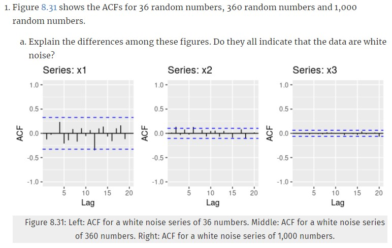

```{r setup, include=FALSE}
knitr::opts_chunk$set(echo = TRUE)
library(fpp2)
library(tidyverse)
```

## Forecasting: Principles and Practice

#### 8.1



The main difference between these figures are that the scale of both the ACF values and the 95% limit lines seems to be decreasing from left to right. Additionally, it appears that some of the patterns change from chart to chart with positive and negative ACF. It does appear that these charts indicate that the data are white noise as there is no identifiable pattern and the spikes don't exceed the bounds more than 5% of the time. 

**$(b)$ Why are the critical values at different distances from the mean of zero? Why are the autocorrelations different in each figure when they each refer to white noise?**

The critical values are at different distances because of the way those lines are calculated. They are calculated as $\frac{\pm1.96}{\sqrt{T}}$ where $T$ is the length of time in the series. Naturally, as T increases, that critical value will get smaller and smaller around the mean zero. As to why the autocorrelations are different in each figure, as part of the autocorrelation formula, we are using the mean of the series. The mean will change with the addition of samples and as such will change the linear relationship between the lagged values. 

#### 8.2

**A classic example of a non-stationary series is the daily closing IBM stock price series (data set `ibmclose`). Use R to plot the daily closing prices for IBM stock and the ACF and PACF. Explain how each plot shows that the series is non-stationary and should be differenced.**

```{r}
ibmclose %>%
ggtsdisplay(main = "Daily Closing IBM Stock Price", ylab = "Sales", xlab = "Time in Days") 
```

Based on the plots above, the data is clearly non-stationary and should be differenced. We can tell in the first line plot that there are ups and downs and that each point on the graph relates to the point before it. When looking at the ACF, we can see that the plot decreases gradually, which is an indicator that differencing is needed because each lag is highly correlated and above the 95% bound indicating that the autocorrelation is significant. The first lag of the PACF plot here is almost one where the other lags are almost 0. This indicates that the data is non-stationary since the first lag is so large. 

#### 8.6

**Use R to simulate and plot some data from simple ARIMA models.**

**$(a)$ Use the following R code to generate data from an AR(1) model with $\phi_1 = 0.6$ and $\sigma^2 = 1$.The process starts with $y_1 = 0$.**

```{r}
y <- ts(numeric(100))
e <- rnorm(100)
for(i in 2:100)
  y[i] <- 0.6*y[i-1] + e[i]
```

**$(b)$ Produce a time plot for the series. How does the plot change as you change $\phi_1$?**


```{r}
ar1 <- function(phi) {
  y <- ts(numeric(100))
  e <- rnorm(100)
  for(i in 2:100) {
    y[i] <- phi*y[i-1] + e[i]
  }
  return (y)
  
}
```

```{r}
df <- data.frame(phi0=ar1(0.1), phi0.2=ar1(0.2), phi0.4=ar1(0.4), phi0.6=ar1(0.6), phi0.8=ar1(0.8)) %>% mutate(t=row_number())
df %>% pivot_longer(cols = -c('t')) %>% ggplot(aes(x=t, y=value, color=name)) + geom_line() + geom_point() + facet_wrap(~name, )
```

It appears that in most cases as $\phi$ gets larger, the variation of $y$ also increases. 

**$(c)$ Write your own code to generate data from an MA(1) model with $\theta_1 = 0.6$ and $\sigma^2 = 1$.** 

```{r}
ma1 <- function(phi) {
  y <- ts(numeric(100))
  e <- rnorm(100)
  for(i in 2:100) {
    y[i] <- phi*e[i-1] + e[i]
  }
  return (y)
}
```

**$(d)$ Produce a time plot for the series. How does the plot change as you change $\theta_1$.**

```{r}
df <- data.frame(theta1=ma1(-1), theta0.5=ma1(-0.5), theta0=ma1(0), theta0.6=ma1(0.6), theta1=ma1(1)) %>% mutate(t=row_number())
df %>% pivot_longer(cols = -c('t')) %>% ggplot(aes(x=t, y=value, color=name)) + geom_line() + geom_point() + facet_wrap(~name, scales = 'fixed')
```

Similar to our charts above, it appears that as you increase theta, the variations on the $y-axis$ increase as well. 

**$(e)$ Generate data from an ARMA(1,1) model with $\phi_1 = 0.6$, $\theta_1$ = 0.6 and $\sigma^2 = 1$.**

```{r}
ma_ar11 <- function(phi, theta) {
  y <- ts(numeric(100))
  e <- rnorm(100)
  for(i in 2:100) {
    y[i] = phi*y[i-1] + theta*e[i-1] + e[i]
  }
  return (y)
}
y = ma_ar11(0.6, 0.6)
p1 = autoplot(y)
p2 = ggAcf(y)
gridExtra::grid.arrange(p1, p2, ncol = 2)
```

**$(f)$ Generate data from an AR(2) model with $\phi_1 = -0.8$, $\phi_2 = 0.3$ and $\sigma^2 = 1$. (Note that these parameters will give a non-stationary series.)**

```{r}
ar2 <- function(phi_1, phi_2) {
  y <- ts(numeric(100))
  e <- rnorm(100, 1)
  for(i in 3:100) {
    y[i] <- phi_1*y[i-1] + phi_2*y[i-2] + e[i]
  }
  return (y)
}
yar2 = ar2(-0.8, 0.3)
```


```{r}
p1 = autoplot(yar2)
p2 = ggAcf(yar2)
gridExtra::grid.arrange(p1, p2, ncol = 2)
```

**$(g)$ Graph the latter two series and compare them.**

The graphs are plotted in the charts above. The ARMA(1,1) model with $\phi_1=0.6$, $\theta_1=0.6$ and $\sigma^2=1$, looks to be much more random in nature, however, the ACF plot does indicate some potential autocorrelation. The AR(2) model with $\phi_1=-0.8$, $\phi_2=0.3$ and $\sigma^2=1$ has a definite pattern that intensifies as time increases. The ACF plot shows a clear trend. This data is not stationary. 

#### 8.8

**Consider austourists, the total international visitors to Australia (in millions) for the period 1980-2015.**


**$(a)$ Use `auto.arima()` to find an appropriate ARIMA model. Which model was selected? Check that the residuals look like white noise. Plot forecasts for the next 10 periods.**

```{r}
fit <- auto.arima(austa)
fit
```
The model that was selected was ARIMA(0,1,1) which is simple exponential smoothing.

```{r}
checkresiduals(fit)
```

The ACF plot looks good and based on the Ljung-Box test results of p=0.8067, we'd fail to reject the null hypothesis and conclude that the residuals do resemble white noise. 

```{r}
autoplot(forecast(fit, h = 10))
```

**$(b)$ Plot forecasts from an ARIMA(0,1,1) model with no drift and compare these to part a. Remove the MA term and plot again.**

```{r}
fit <- Arima(austa, order = c(0,1,1), include.drift = FALSE)
arima_wo_dft <- autoplot(forecast(fit, h = 10)) + ggtitle("Forecast from ARIMA with out drift")
arima_wo_dft
```

The forecast without drift has a wider confidence interval and the trend is horizontal as opposed to increasing.

```{r}
fit <- Arima(austa, order = c(0,1,0), include.drift = FALSE)
p_wo_ma <- autoplot(forecast(fit, h = 10))
p_wo_ma
```

The forecast without MA is almost indistinguishable from the previous plot, however, we see that the trend line is slightly higher.  

**$(c)$ Plot forecasts from an ARIMA(2,1,3) model with drift. Remove the constant and see what happens.**

```{r}
fit <- Arima(austa, order=c(2,1,3), method='ML', include.drift=T)
autoplot(forecast(fit,h=10))
```

The forecast above shows the upward trend with a relatively narrow confidence interval. Now, we'll remove the constant. 

```{r}
fit <- Arima(austa, order=c(2,1,3), method='ML', include.drift=T, include.constant =FALSE)
autoplot(forecast(fit,h=10))
```

We can see that by removing the constant, the confidence interval has grown and has taken on a cone shape.  

**$(d)$ Plot forecasts from an ARIMA(0,0,1) model with a constant. Remove the MA term and plot again.**

```{r}
fit_4 <- Arima(austa, order = c(0,0,1), include.constant = TRUE)
autoplot(forecast(fit_4, h = 10))
```

Now, let's remove the MA term: 

```{r}
fit_5 <- Arima(austa, order = c(0,0,0), include.constant = TRUE)
autoplot(forecast(fit_5, h = 10))
```

It appears that the forecast are the mean of the data history and the confidence interval spans the entire y-axis. 

**$(e)$ Plot forecasts from an ARIMA(0,2,1) model with no constant.**

```{r}
fit_6 <- Arima(austa, order = c(0,2,1), include.constant = FALSE)
autoplot(forecast(fit_6, h = 10))
```

The forecast shows an upward trend with a noticeable cone shaped confidence interval.  

