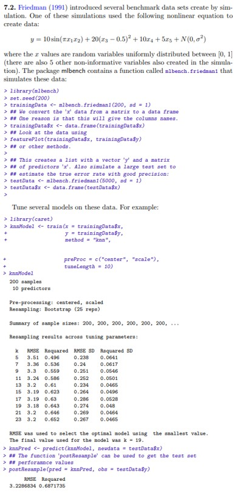
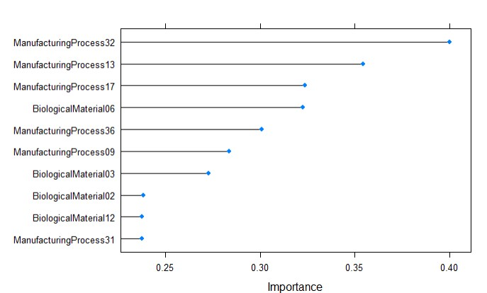

```{r setup, include=FALSE}
knitr::opts_chunk$set(echo = TRUE)
library(mlbench)
library(tidyverse)
library(mice)
library(caret)
library(tidymodels)
library(AppliedPredictiveModeling)
```

## Homework 5: Applied Predictive Modeling

#### 7.2

{width="444"}

```{r}
set.seed(200)
trainingData <- mlbench.friedman1(200, sd = 1)
trainingData$x <- data.frame(trainingData$x)

testData <- mlbench.friedman1(5000, sd = 1)
testData$x <- data.frame(testData$x)

knn_fit<- train(x=trainingData$x,y=trainingData$y, method = "knn", preProcess = c("center", "scale"), tuneLength = 10)
knnPred <- predict(knn_fit, newdata = testData$x)
postResample(pred = knnPred, obs = testData$y)
```

We now look at the variable importance of the knn fit.

```{r message=FALSE, warning=FALSE}
varImp((knn_fit))
```

It appears that variables X1-X10 are relevant to the KNN model with the exception of X7.

Let's now look at a Multivariate Adaptive Regression Splines model (MARS):

```{r}
MARS_fit<- train(x = trainingData$x, y = trainingData$y, method = "earth",
  preProcess = c("center", "scale"), tuneLength = 10)

MARS_pred <- predict(MARS_fit, newdata = testData$x)
postResample(pred = MARS_pred, obs = testData$y)
```

Having fit our model, lets see which variables are important to the fit.

```{r}
varImp(MARS_fit)
```

Looking at the output above, we can see that X1-X5 are relevant to the model which we know are the informative predictors.

#### 7.5

Exercise 6.3 describes data for a chemical manufacturing process. Use the same data imputation, data splitting, and pre-processing steps as before and train several nonlinear regression models.

Our previous run resulted in the following metrics on the test set:

{width="321"}

We'll use the same setup to test some non-linear methods:

```{r message=FALSE, warning=FALSE}

data("ChemicalManufacturingProcess")
ChemicalManufacturingProcess <- mice(data = ChemicalManufacturingProcess, m = 1, method = "pmm", seed = 123)
ChemicalManufacturingProcess <- mice::complete(ChemicalManufacturingProcess, 1)

set.seed(123)

train_test_split <- initial_split(ChemicalManufacturingProcess, prop = 0.80)

train <- training(train_test_split)

test <- testing(train_test_split)

features_train <- train[, -1]
y_train <- train[,1]

features_test <- test[, -1]
y_test <- test[,1]

ctrl <- trainControl(method = 'cv', number = 10)
```

**$(a)$ Which nonlinear regression model gives the optimal resampling and test set performance?**

-   KNN

```{r}
knn <- train(features_train, y_train, 
                 method="knn", 
                 trControl = ctrl, 
                 preProc = c('YeoJohnson', 'center', 'scale', 'pca'))
knn_predictions <- predict(knn, newdata=features_test)
knn
```

```{r}
postResample(pred=knn_predictions,y_test)
```

-   Neural Networks

```{r}
nnetGrid <- expand.grid(size=c(1:10),
                        decay = c(0,0.01,.1),
                      bag = FALSE )

nnetTune <- train(features_train, y_train, 
                  method="avNNet",  
                  tuneGrid = nnetGrid, 
                 preProc = c('YeoJohnson', 'center', 'scale', 'pca'),
                 linout=T,
                 trace=F, 
                 MaxNWts=10 * (ncol(features_train)+1) + 10 + 1, maxit=500)
nnetTune
```

```{r}
nn_predictions <- predict(nnetTune, newdata=features_test)
postResample(pred=nn_predictions,y_test)
```

-   Support Vector Machines

```{r}
svm <- train(features_train, y_train, 
                 method="svmRadial", 
                 trControl = ctrl, 
                 preProc = c('YeoJohnson', 'center', 'scale', 'pca'))

svm
```

```{r}
svm_predictions <- predict(svm, newdata=features_test)
postResample(pred=svm_predictions,y_test)
```

Looking at RMSE, the SVM model was just slightly better than the KNN model. However, both of these models did better than our elastic net model from chapter 6. The neural network model, however, did not do very well. It performed worse than our previous elastic net model.

| Model Name  | RMSE      | $R^2$     | MAE       |
|-------------|-----------|-----------|-----------|
| elastic net | 1.4203776 | 0.4330233 | 1.1207388 |
| KNN         | 1.4203776 | 1.4203776 | 1.4203776 |
| Neural Net  | 1.4203776 | 1.4203776 | 1.4203776 |
| SVM         | 1.4203776 | 1.4203776 | 1.4203776 |


**$(b)$ Which predictors are most important in the optimal nonlinear regression model? Do either the biological or process variables dominate the list? How do the top ten important predictors compare to the top ten predictors from the optimal linear model?**

Based on the metrics above, we chose the SVM model as our optimal model. Let's now look at the variable importance: 

```{r}
svm_var_imp <- varImp(svm)
plot(svm_var_imp, top = 10)
```

Looking at the variable importance, we can see that the variable importance is split between the manufacturing and biological predictors. One does not outweight the other. They are both needed. 

Our previous model from Ch.6 placed the following importance on the top features: 



In looking at this, we can see that the importance is exactly the same as our previous run with the elastic net model. 


**$(c)$ Explore the relationships between the top predictors and the response for the predictors that are unique to the optimal nonlinear regression model.Do these plots reveal intuition about the biological or process predictors and their relationship with yield?**

```{r fig.height=8, fig.width=12}
svm_imp_df <- rownames(svm_var_imp$importance  %>%
                data.frame() %>% 
                arrange(desc(Overall)) %>% 
                top_n(10, wt = Overall))

var_top_10 <- train[,names(train) %in% c(svm_imp_df, 'Yield')]# %>%
 # bind_cols(Yield = ChemicalManufacturingProcess$Yield)


var_top_10 %>%
  gather(variable, value, -Yield) %>%
  ggplot(aes(x = value, y = Yield)) +
  geom_point() +
  facet_wrap(~variable, scales = 'free_x') +
  labs(x = element_blank())
```


Looking at the results above, we see no differences than reported in 6.3. We can see that the features are strongly correlated. For Biological Material 02, 05, 06, and 12 as well as manufacturing process 09, and 32, the more we increase these values, the greater our yield will be. Conversely, for those not mentioned, these variables have negatively correlated relationships, meaning the more we can minimize these values, the higher our yield will be. 